# 🔍 Magpie - Your Intelligent Report Assistant

Magpie is an AI-powered report intelligence platform that transforms how organizations handle SaaS reports through an innovative email-first approach. By providing a single intelligent email address, Magpie automatically collects, organizes, and analyzes reports from various SaaS tools, turning scattered information into actionable insights.

## 🌟 Key Features

- **Zero Integration Required**: Just change your report email settings once, and Magpie handles the rest
- **Universal Compatibility**: Works with any SaaS tool that can send email reports
- **Intelligent Classification**: Automatically categorizes and organizes reports by type and source
- **Natural Language Queries**: Ask questions in plain English and get instant insights
- **Privacy-First Design**: Only processes designated reports - not your entire inbox
- **Smart Summaries**: Automated executive summaries and trend analysis
- **Real-time Alerts**: Configurable thresholds for critical metrics

## 🔧 Supported Platforms

- **AWS**: Billing reports, usage metrics, cost explorer, forecasts
- **Salesforce**: Pipeline reports, sales forecasts, activity tracking
- **Jira**: Sprint reports, velocity charts, issue tracking
- **And many more**: Compatible with any platform that sends email reports

## 📊 Benefits

- **Time Savings**: Reduce report processing time by 92%
- **Enhanced Insights**: Never miss critical trends or patterns
- **Faster Decisions**: Get answers instantly without manual data compilation
- **Better Organization**: All your reports in one searchable knowledge base

## 🚀 Quick Start

1. **Sign Up**: Get your Magpie email address (e.g., `reports@company.magpie.report`)
2. **Configure Sources**: Update report delivery settings in your SaaS tools
3. **Choose Report Types**: Select which reports you want to process
4. **Set Preferences**: Configure frequencies and alert thresholds
5. **Start Getting Insights**: Use natural language to query your data

## 💡 Use Cases

- **Executive Reporting**: Automated summaries across all tools
- **Cost Management**: Track and analyze spending across platforms
- **Performance Monitoring**: Unified view of key metrics
- **Trend Analysis**: Identify patterns and anomalies automatically

## 🔒 Privacy & Security

Magpie is built with privacy at its core:
- Only processes explicitly designated reports
- No access to general emails
- Enterprise-grade encryption
- Configurable data retention policies
- Complete audit trail
- Transparent data processing

## 🔄 How It Works

```mermaid
flowchart LR
    A[Sign Up] -->|"1️⃣"| B[Get Magpie Email]
    B -->|"2️⃣"| C[Configure SaaS Tools]
    C -->|"3️⃣"| D[Automatic Processing]
    
    D -->|"4️⃣"| E[Daily/Weekly Summaries]
    D -->|"4️⃣"| F[WhatsApp Queries]
    
    subgraph "📊 Outputs"
        E
        F
    end
    
    subgraph "⚙️ Setup Steps"
        A
        B
        C
    end
    
    subgraph "🤖 Magpie AI"
        D
    end
    
    %% Styling
    classDef default fill:#f9f9f9,stroke:#333,stroke-width:2px;
    classDef highlight fill:#e3f2fd,stroke:#1565c0,stroke-width:2px;
    classDef output fill:#e8f5e9,stroke:#2e7d32,stroke-width:2px;
    
    class D highlight;
    class E,F output;
```

## 🛠️ Technical Architecture

## 📈 Impact

- **Time Saved**: 10+ hours weekly per team
- **Processing Speed**: 92% reduction in report processing time
- **Coverage**: Handles 30+ automated reports weekly
- **Accuracy**: Catches insights often missed in manual review

## 🤝 Contributing

We welcome contributions! Please see our [Contributing Guidelines](CONTRIBUTING.md) for details.

## 📄 License

This project is licensed under the MIT License - see the [LICENSE](LICENSE) file for details.

## 📧 Support

Need help? Check out our:
- [Documentation](docs/)
- [Setup Guides](docs/setup/)
- [Video Tutorials](docs/tutorials/)
- [Contact Support](mailto:support@magpie.report)

---

Built with ❤️ by the Magpie team
