# Magpie

# One Smart Email. All Your SaaS Insights.

Transform scattered SaaS reports into actionable intelligence through a single email address. No integrations. No complexity. Just insights.

[Get Started](https://dashboard.magpie.report) · [Documentation](docs/) · [Examples](examples/) · [Community](https://discord.gg/V37aCRZy3T)

---

## ✨ The Problem We Solve

Executives and teams receive **30+ critical reports weekly** from different SaaS tools - buried in emails, mixed formats, different schedules. Important insights get lost, and hours are wasted collecting and analyzing data.

## 💡 Our Solution

Set up your Magpie email (`reports@company.magpie.report`), update your SaaS report settings once, and let our AI:
- 📊 Automatically organize all your reports
- 🤖 Extract and analyze key insights
- 📱 Make data queryable via WhatsApp
- 📈 Generate smart summaries
- ⚡ Alert you about important trends

```mermaid
flowchart LR
    A[Sign Up] -->|"1️⃣"| B[Get Magpie Email]
    B -->|"2️⃣"| C[Configure SaaS Tools]
    C -->|"3️⃣"| D[Automatic Processing]
    
    D -->|"4️⃣"| E[Daily/Weekly Summaries]
    D -->|"4️⃣"| F[WhatsApp Queries]
    
    subgraph "📊 Outputs"
        E
        F
    end
    
    subgraph "⚙️ Setup Steps"
        A
        B
        C
    end
    
    subgraph "🤖 Magpie AI"
        D
    end
```

## 🎯 Key Features

- **Zero-Integration Setup**: Just change email settings in your SaaS tools
- **Privacy-First**: Only processes designated reports, not your entire inbox
- **Universal Compatibility**: Works with any tool that can email reports
- **Natural Language Queries**: Ask questions in plain English via WhatsApp
- **Intelligent Summaries**: Automated insights and trend analysis

## 📊 Supported Platforms

- **AWS**: Billing, usage metrics, cost forecasts
- **Salesforce**: Pipeline, forecasts, activity reports
- **Jira**: Sprint reports, velocity charts
- **And More**: Any platform that sends email reports

## 🚀 Getting Started

1. Sign up at [dashboard.magpie.report](https://dashboard.magpie.report)
2. Get your dedicated Magpie email address
3. Update report settings in your SaaS tools
4. Start receiving organized insights

Check our [Quick Start Guide](docs/quickstart.md) for detailed setup instructions.

## 💼 Use Cases

- **Executive Teams**: Consolidated insights across all tools
- **Finance Teams**: Unified cost and billing analysis
- **Engineering Teams**: Performance and incident tracking
- **Sales Teams**: Pipeline and forecast monitoring

## 📈 Impact

- **92%** reduction in report processing time
- **10+** hours saved weekly per team
- **100%** of critical trends identified
- **Zero** integration overhead

## 🛡️ Privacy & Security

- Only processes explicitly designated reports
- Enterprise-grade encryption
- Configurable retention policies
- Complete audit trail
- SOC 2 Type II certified

## 🤝 Contributing

We welcome contributions! Please see our [Contributing Guide](CONTRIBUTING.md) for details.

## 📜 License

This project is licensed under the MIT License - see the [LICENSE](LICENSE) file for details.

---

Built with ❤️ for teams drowning in SaaS reports

[Website](https://magpie.report) · [Documentation](docs/) · [Support](mailto:support@magpie.report)

